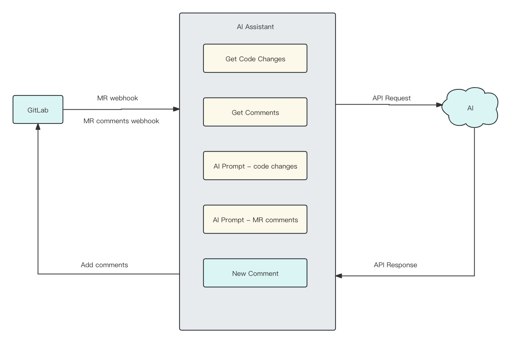

## GitLab AI Chat Assistant

[Readme in English](./README_en.md)

通过 GitLab Webhook 与 ChatGPT 进行集成，以便在 GitLab Merge Request 或 Issues 的讨论中直接对话、获取 AI 的答案，并将答案添加到相应的讨论中。

- 支持对 MR 的代码变更进行 AI 评审（自动触发）
- 支持在 MR 的代码评审中 @<ai_username> 进行多轮对话，如：`@cs_ops，关于你的第三条建议，请给出代码示例Demo。`
- 支持在 Issue 的评论中 @<ai_username> 进行多轮对话，如：`@cs_ops，请帮我重新整理上一个问题。`

流程图：



#### 服务安装说明

1. 安装依赖：运行 `pip install flask requests openai` 安装所需的 Python 依赖项。

2. 配置 GitLab 和 OpenAI API：在代码中设置 `gitlab_server_url`、`gitlab_private_token` 和 `openai.api_key` 、`openai.base_url` 为您的 GitLab 和 OpenAI API 的访问密钥、API 服务器。

3. 运行应用：运行应用 `python your_app_name.py`。

4. 设置 GitLab Webhook：在 GitLab 项目设置中添加 Webhook，将其指向您的应用的 `/gitlab_ai_webhook` 路由。如：`http://43.155.75.47:9998/gitlab_ai_webhook`

#### 工作流程

1. 当有新的MR合并请求、MR 或 Issue讨论时，GitLab 将触发 Webhook，向您的 Flask 应用发送有关讨论的 JSON 数据。

2. 提取项目 ID、Merge Request ID、Issue ID、Discussion ID 以及讨论内容，并将其用于后续处理。

3. 使用 ChatGPT 模型将收到的Discussion内容及对话历史，通过固定格式发送给 ChatGPT，并获取 ChatGPT 的回答。

4. 使用 GitLab API 将 ChatGPT 的回答添加到对应 Merge Request 的讨论中。

ChatGPT API 支持提交历史对话，提交格式：

```json
messages = [
  {'role': 'system', 'content': '你是一位资深编程专家，负责代码变更的审查工作。当用户在 GitLab MR 合并请求的 Notes中提及你的时候，你需要回答他们的问题。'}, 
  {'role': 'assistant', 'content': '# gitlab-ai-code-review.py\n\nAI review 意见如下: (2647 tokens)\n\n## 代码审查反馈\n### 1. 变更的决定和描述\n拒绝变更，变更评分：20\n### 2. 存在的问题和建议\n- 缺少文档注释和注释说明，难以理解代码的作用和意图。\n- 部分变量名和方法名缺乏描述性，不易理解其用途。\n- 代码中存在硬编码的配置信息，建议使用配置文件或环境变量存储。\n- 代码结构混乱，缺乏模块化和清晰的组织，可读性差。\n- 异步执行任务的方式不够清晰，缺少错误处理机制和超时处理。\n- 代码中的日志打印信息不够规范，不易排查问题。\n### 3. 修改建议\n建议重构代码，遵循良好的注释规范和命名规范，将配置信息抽离为独立的配置文件或使用环境变量进行管理，重新组织代码结构，引入错误处理机制和超时处理，并优化日志打印方式，以提高代码可读性和可维护性。🚧'}, 
  {'role': 'user', 'content': '你反馈的最后一个问题，如何更加规范？请给出示例。'}, 
  {'role': 'assistant', 'content': '当我提到日志打印信息不够规范时，我建议采用更加标准化和易读的日志格式。例如，你可以考虑使用以下格式来记录日志：\n```\n2021-01-15 13:45:30 [INFO] - 完成数据处理任务\n2021-01-15 13:46:15 [ERROR] - 无法连接数据库，错误信息：连接超时\n2021-01-15 13:50:02 [WARNING] - 检测到内存使用率过高\n```\n在这个示例中，我们使用了时间戳、日志级别（INFO、ERROR、WARNING）和描述信息，使得日志信息更加清晰和易于排查问题。同时，请确保日志级别和内容的描述准确表达了相应的信息。'}, 
  {'role': 'user', 'content': '关于你给的倒数第二个建议，也请给出正确的示范。'}, 
  {'role': 'assistant', 'content': '当提到重构代码并引入错误处理机制和超时处理时，以下是一个可能的示例：\n```python\nimport asyncio\nasync def task_with_timeout():\n    try:\n        # 执行可能耗时的任务\n        result = await asyncio.wait_for(time_consuming_operation(), timeout=5)\n        # 处理结果\n        process_result(result)\n    except asyncio.TimeoutError:\n        # 超时处理\n        handle_timeout_error()\n    except Exception as e:\n        # 其他异常处理\n        handle_other_errors(e)\nasync def main():\n    try:\n        await task_with_timeout()\n    except Exception as e:\n        # 异常处理\n        handle_main_error(e)\nasyncio.get_event_loop().run_until_complete(main())\n```\n在这个示例中，我们使用了 asyncio 库来创建一个任务，并使用 await asyncio.wait_for 来设置任务的超时时间。除了超时处理之外，我们还包含了其他异常的处理，以保证代码的健壮性和可靠性。'}, 
  {'role': 'user', 'content': '好，对于其他的建议，也请给出相应的代码示例。'}, 
  {'role': 'assistant', 'content': '当提到缺少文档注释和注释说明时，以下是一个可能的示例：\n```python\ndef calculate_total_price(prices, quantities):\n    """\n    计算订单的总价\n    Args:\n      prices: 商品单价列表\n      quantities: 商品数量列表\n    Returns:\n      订单总价\n    """\n    total = 0\n    for price, qty in zip(prices, quantities):\n        total += price * qty\n    return total\n```\n在这个示例中，我们使用了函数注释来描述函数的作用、参数和返回值，以便其他开发人员能够更容易地理解和使用这段代码。\n当提到部分变量名和方法名缺乏描述性时，以下是一个可能的示例：\n```python\nclass Car:\n    def __init__(self, make, model, year):\n        self.make = make  # 制造商\n        self.model = model  # 型号\n        self.year = year  # 出厂年份\n```\n在这个示例中，我们使用了注释来对变量进行说明，从而增加代码的可读性和可维护性。\n当提到代码结构混乱，缺乏模块化和清晰的组织时，以下是一个可能的示例：\n```\n# app.py\nfrom helper import calculate_total_price\nprices = [10, 20, 30]\nquantities = [1, 2, 3]\ntotal_price = calculate_total_price(prices, quantities)\nprint(f"The total price is: {total_price}")\n```\n在这个示例中，我们将计算订单总价的逻辑提取到了独立的 helper 模块中，使得代码结构更加清晰和模块化。\n希望这些示例可以帮助你更好地理解我的建议！'}, 
  {'role': 'user', 'content': '@cs_ops 很好，谢谢。'}, 
  {'role': 'assistant', 'content': '不客气，如果您有任何其他问题，都可以随时@我。祝您工作顺利！👨\u200d💻🚀'}
]
```

#### 注意事项

- 目前暂未获取 MR changes，与问题及历史一起提交给 AI，通常change的变更比较多，导致token长度超限，后续可以根据大模型的限制情况，按需调整和添加。
