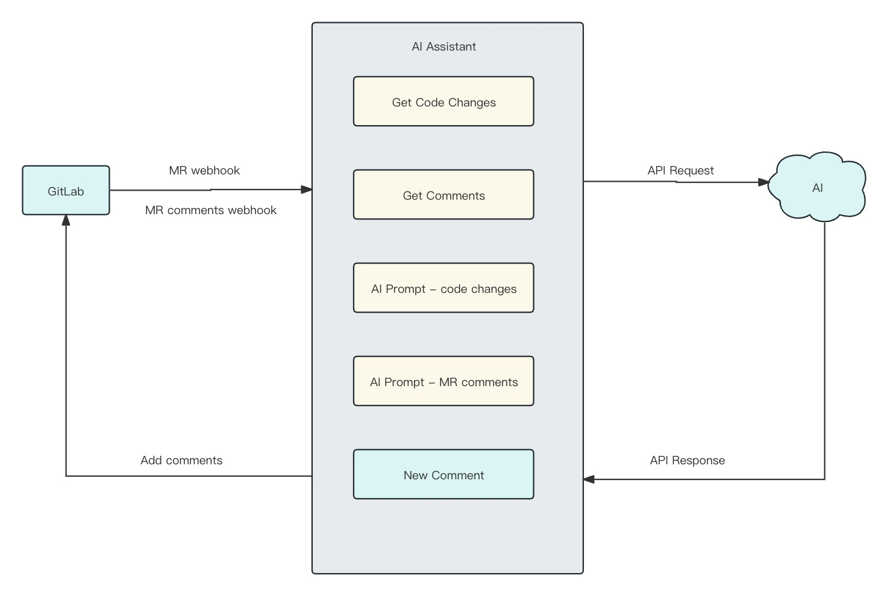

## GitLab AI Chat Assistant

[中文版](./README.md)


Integrating with ChatGPT via GitLab Webhook to engage in direct conversations during GitLab Merge Request or Issue discussions, receive AI-generated responses, and add these responses to the corresponding discussions.

- Supports AI review of code changes in MRs (automatically triggered).
- Supports multi-turn conversations with @<ai_username> during code review in MRs, e.g., `@cs_ops, please provide a code example for your third suggestion.`
- Supports multi-turn conversations with @<ai_username> in Issue comments, e.g., `@cs_ops, please help me rephrase the previous question.`

Workflow Diagram:



#### Installation Instructions

1. Install Dependencies: Run `pip install flask requests openai` to install necessary Python dependencies.

2. Configure GitLab and OpenAI API: Set `gitlab_server_url`, `gitlab_private_token`, `openai.api_key`, and `openai.base_url` in the code with your GitLab and OpenAI API access keys and API server.

3. Run the Application: Run the application with `python your_app_name.py`.

4. Set up GitLab Webhook: Add a webhook in your GitLab project settings pointing to the `/gitlab_ai_webhook` route of your application. For example: `http://43.155.75.47:9998/gitlab_ai_webhook`

#### Workflow

1. When there's a new MR, Merge Request, or Issue discussion, GitLab triggers the webhook and sends JSON data about the discussion to your Flask application.

2. Extract project ID, Merge Request ID, Issue ID, Discussion ID, and discussion content for further processing.

3. Use the ChatGPT model to send the received discussion content and conversation history to ChatGPT in a fixed format and get ChatGPT's response.

4. Use the GitLab API to add ChatGPT's response to the corresponding Merge Request discussion.

ChatGPT API supports submitting historical conversations in the following format:

```json
messages = [
  {'role': 'system', 'content': 'You are a senior programming expert responsible for code review of changes. When users mention you in the Notes of GitLab MR Merge Requests, you need to answer their questions.'}, 
  {'role': 'assistant', 'content': '# gitlab-ai-code-review.py\n\nAI review suggestions: (2647 tokens)\n\n## Code Review Feedback\n### 1. Decisions and Descriptions of Changes\nRejected changes, change score: 20\n### 2. Issues and Suggestions\n- Lack of documentation comments and explanations, making it difficult to understand the code's purpose and intent.\n- Some variable and method names lack descriptiveness, making it hard to understand their purpose.\n- Hardcoded configuration information in the code, consider using configuration files or environment variables.\n- Disorganized code structure, lacking modularity and clear organization, poor readability.\n- Asynchronous task execution is unclear, lacking error handling and timeouts.\n- Log printouts in the code are not standardized, making issue troubleshooting difficult.\n### 3. Modification Suggestions\nRecommend code refactoring, adhere to good commenting and naming conventions, extract configuration information into separate files or manage using environment variables, reorganize code structure, introduce error handling mechanisms and timeouts, and optimize logging practices for improved code readability and maintainability.🚧'},
  {'role': 'user', 'content': 'How can I make the last issue more standardized? Please provide an example.'},
  {'role': 'assistant', 'content': 'When I mentioned that log printouts are not standardized, I suggest using a more standardized and readable log format. For example, you may consider using the following format to log messages:\n```\n2021-01-15 13:45:30 [INFO] - Data processing task completed\n2021-01-15 13:46:15 [ERROR] - Failed to connect to the database, error: Connection timed out\n2021-01-15 13:50:02 [WARNING] - High memory usage detected\n```\nIn this example, we use timestamps, log levels (INFO, ERROR, WARNING), and descriptive messages, making the log information clearer and easier to troubleshoot. Also, ensure the log level and content accurately convey the respective information.'},
  {'role': 'user', 'content': 'For your penultimate suggestion, please provide the correct demonstration as well.'},
  {'role': 'assistant', 'content': 'When referring to refactoring code and introducing error handling mechanisms and timeouts, here is a possible example:\n```python\nimport asyncio\nasync def task_with_timeout():\n    try:\n        # Perform potentially time-consuming task\n        result = await asyncio.wait_for(time_consuming_operation(), timeout=5)\n        # Process the result\n        process_result(result)\n    except asyncio.TimeoutError:\n        # Timeout handling\n        handle_timeout_error()\n    except Exception as e:\n        # Other error handling\n        handle_other_errors(e)\nasync def main():\n    try:\n        await task_with_timeout()\n    except Exception as e:\n        # Error handling\n        handle_main_error(e)\nasyncio.get_event_loop().run_until_complete(main())\n```\nIn this example, we use the asyncio library to create a task and use await asyncio.wait_for to set a timeout for the task. Besides handling timeouts, we include handling for other exceptions to ensure code robustness and reliability.'},
  {'role': 'user', 'content': 'Great, could you also provide corresponding code examples for other suggestions?'},
  {'role': 'assistant', 'content': 'When mentioning the lack of documentation comments and explanations, here is a possible example:\n```python\ndef calculate_total_price(prices, quantities):\n    """\n    Calculate the total price of the order\n    Args:\n      prices: List of item prices\n      quantities: List of item quantities\n    Returns:\n      Total order price\n    """\n    total = 0\n    for price, qty in zip(prices, quantities):\n        total += price * qty\n    return total\n```\nIn this example, we use function annotations to describe the function's purpose, parameters, and return values, making it easier for other developers to understand and utilize this piece of code.\nWhen addressing the lack of descriptiveness in some variable and method names, here is a possible example:\n```python\nclass Car:\n    def __init__(self, make, model, year):\n        self.make = make  # Manufacturer\n        self.model = model  # Model\n        self.year = year  # Year of manufacture\n```\nIn this example, we use comments to explain the variables, enhancing the code's readability and maintainability.\nWhen mentioning disorganized code structure, lacking modularity and clear organization, here is a possible example:\n```\n# app.py\nfrom helper import calculate_total_price\nprices = [10, 20, 30]\nquantities = [1, 2, 3]\ntotal_price = calculate_total_price(prices, quantities)\nprint(f"The total price is: {total_price}")\n```\nIn this example, we extract the logic for calculating the total order price into a separate helper module, making the code structure clearer and more modular.\nI hope these examples help you better understand my suggestions!'},
  {'role': 'user', 'content': '@cs_ops Great, thank you.'},
  {'role': 'assistant', 'content': 'You're welcome! Feel free to @ me if you have any other questions. Wishing you a productive day!👨\u200d💻🚀'}
]
```

#### Note

- Currently, MR changes are not fetched together with the issues and history submitted to the AI. Typically, the changes in the MR can be quite extensive, causing the token length to exceed the limit. This can be adjusted and supplemented as per the limitations of the large-scale model in the future.